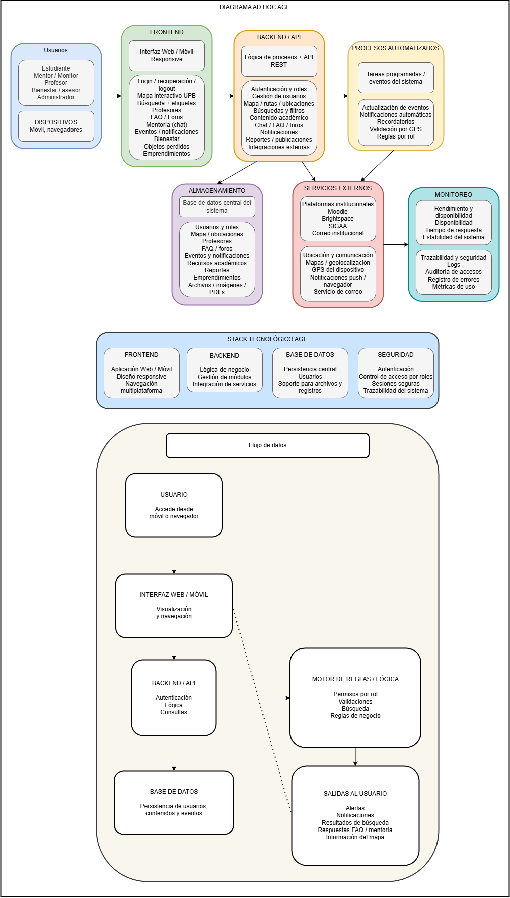
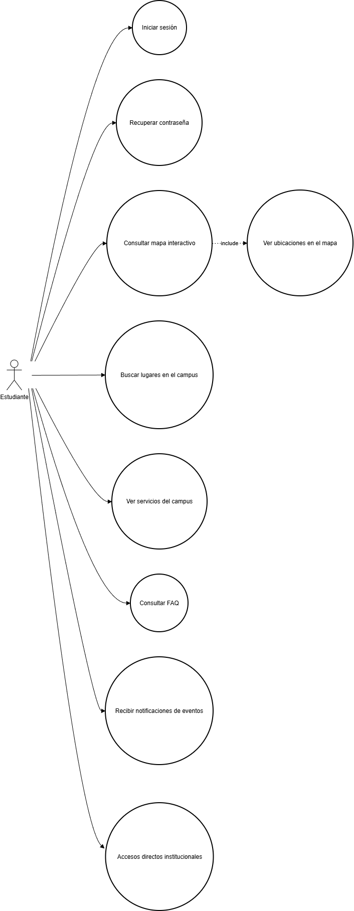
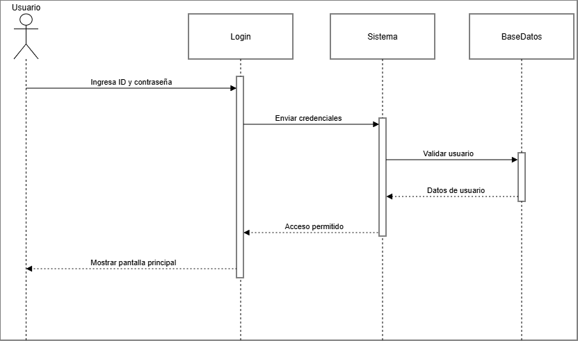
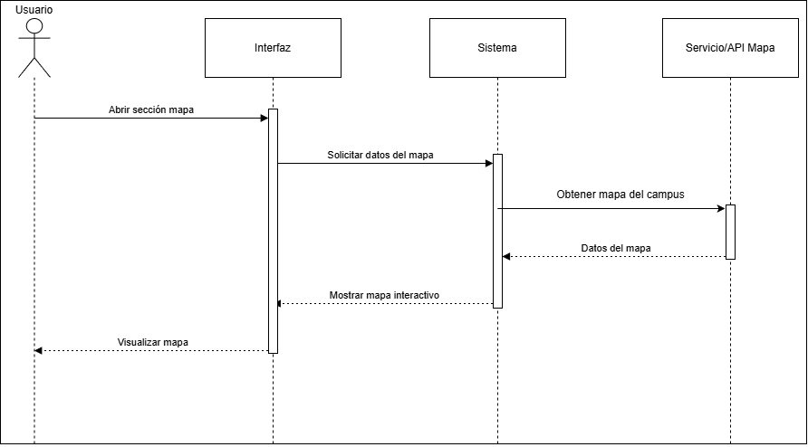
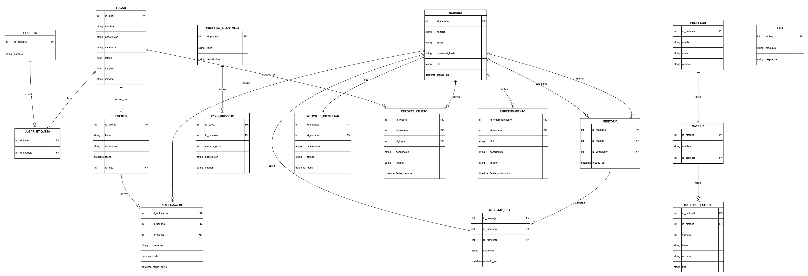
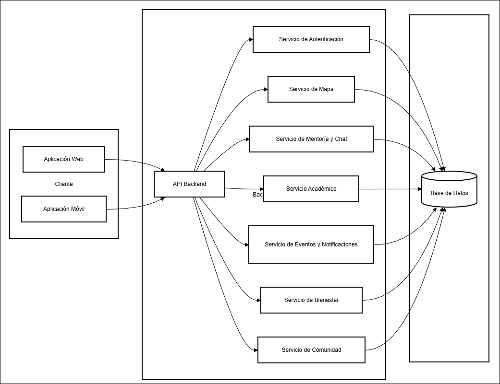

# UML - Diagramas del Proyecto del Asistente General Estudiantil (AGE)

En este documento se presentan los diagramas UML que ilustran el comportamiento y el diseño la página.

---

## 1. Diagrama AD HOC

---

## 2. Diagrama de Casos de Uso

---

## 3. Diagramas de Secuencia
### 3.1 Diagrama de Secuencia - Caso de uso 1: Cliente se Logea

### 3.2 Diagrama de Secuencia - Caso de uso 2: Consulta del mapa

---

## 4. Diagrama de Modelo Relacional
 

---

## 5. Diagrama de Componentes
 
